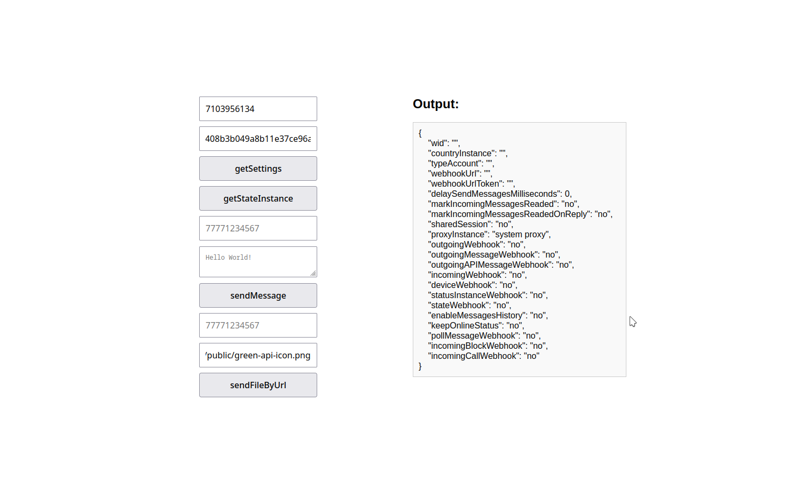
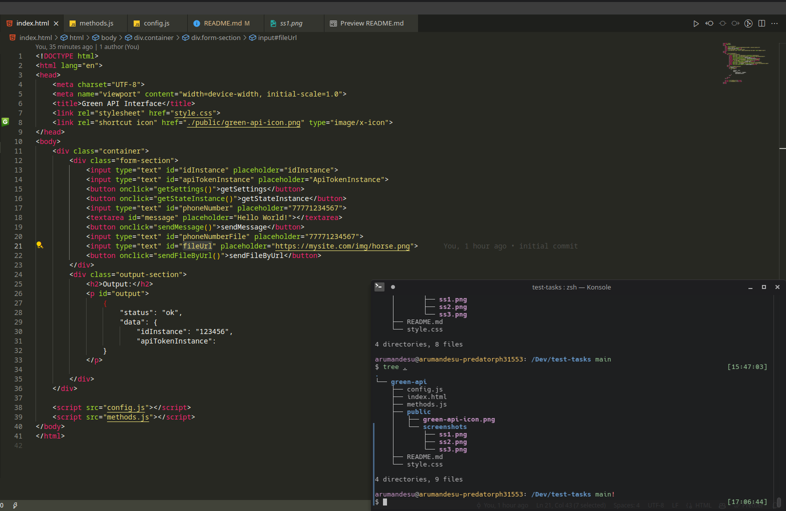
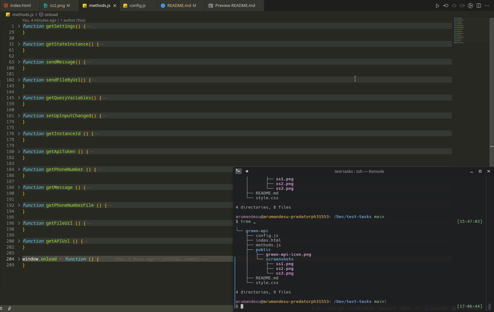

# Green API Test Task

This repository contains the test task from Green API.

## Task Description

### Requirements:

1. Develop an HTML page with calls to GREEN-API methods:
   - `getSettings`
   - `getStateInstance`
   - `sendMessage`
   - `sendFileByUrl`
2. Include connection parameters for the instance on the page:
   - `idInstance`
   - `ApiTokenInstance`
3. Display the response of the methods in a separate read-only field on the page.
4. Follow the provided layout (see the image below).

### Workflow:

1. The user logs into the GREEN-API personal account and creates a new instance on a free developer account.
2. The user scans a QR code and connects their phone number to the instance.
3. The user visits the page you developed and enters the connection parameters:
   - `idInstance`
   - `ApiTokenInstance`
4. The user sequentially clicks the buttons `getSettings`, `sendMessage`, and sees the result of the operations – messages are sent, and the response of the methods is displayed on the page.

## API Documentation

The API documentation can be found in the [API Documentation](https://green-api.com/docs/).

## Screenshots

